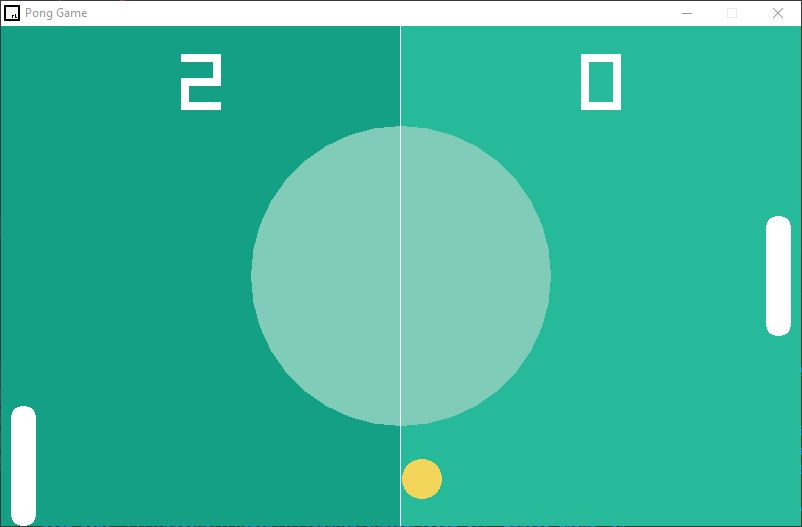

# Pong

```
- This game is created using the Raylib library and runs C++ code underneath it.
- The project is designed to refine object-oriented concepts in C++.
```

# Preview

<p align="center">
  
</p>

---
